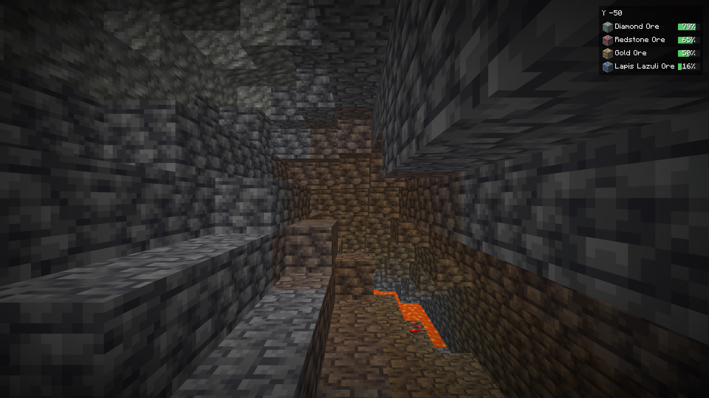
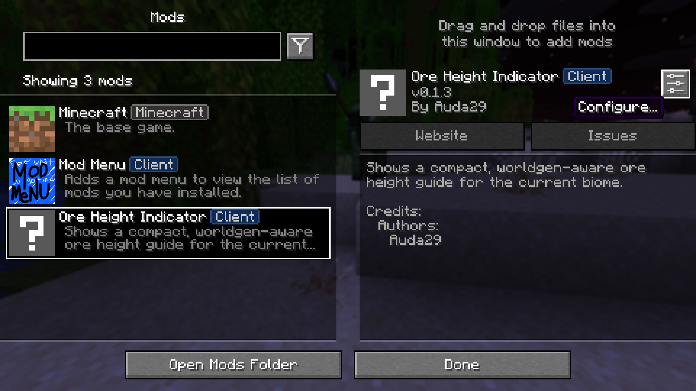
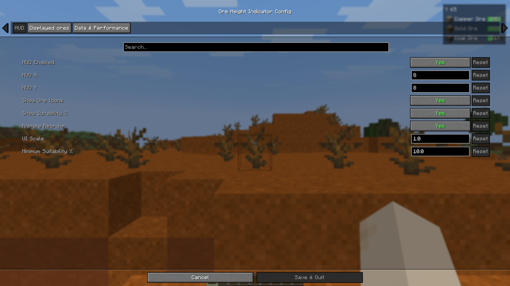
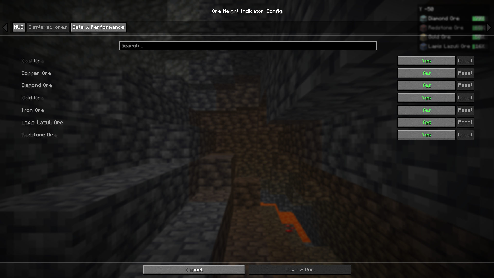
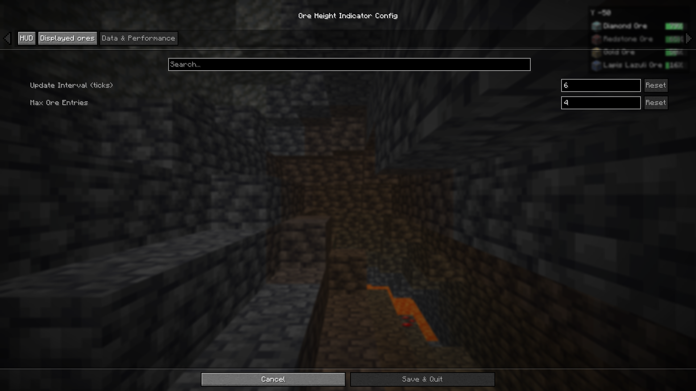

# Ore Height Indicator user guide

This guide explains the mod step by step. You do not need commands, cheats, or a server installation.

> Screenshots use Minecraft 1.21.11. The mod works the same way in Minecraft 26.2.

## 1. Install the mod

You need three things:

1. **Fabric Loader** for your Minecraft version
2. **Fabric API**
3. The Ore Height Indicator file that matches your Minecraft version

Choose the file carefully:

| Your game | File name ends with | Java |
| --- | --- | --- |
| Minecraft 1.21.11 | `+mc1.21.11.jar` | Java 21 |
| Minecraft 26.2 | `+mc26.2.jar` | Java 25 |

Put Fabric API and Ore Height Indicator in your `.minecraft/mods` folder, then start the Fabric installation from the Minecraft Launcher.

You only need the mod on your own computer. It is a client-side mod, so a multiplayer server does not need to install it.

## 2. Enter a world

The HUD appears automatically after you enter a world. Look in the **top-right corner** of the screen.

Press `H` to hide it. Press `H` again to show it.

If another mod already uses `H`, open:

**Options → Controls → Key Binds → Ore Height Indicator**

There you can choose a different key.

*The HUD automatically ranks the ores that best match the current height and location.*

## 3. Read the HUD

The HUD is a quick guide for your current location:

1. **Y** is your current height. Smaller or negative numbers mean you are deeper underground.
2. The ores are sorted by how well your current height matches them. The best match is at the top.
3. The green bar shows how good this height is compared with that ore's best detected height.
4. The list updates when you change height, biome, or dimension.

The percentage is **not** the chance that the next block contains that ore. For example, `80%` means this height is about 80% as suitable as the best detected height for this ore. It does not mean that 80% of nearby blocks are ore.

Do not add the percentages together. Percentages for different ores are not directly comparable.

## 4. Change the settings

For an in-game settings screen, install both optional mods:

- **Mod Menu**
- **Cloth Config API**

Then open:

**Main Menu or Pause Menu → Mods → Ore Height Indicator → Configure**

The settings are split into three sections:

### HUD

- **HUD Enabled:** shows or hides the guide
- **HUD X / HUD Y:** moves the guide away from the top-right corner
- **Show Ore Icons:** shows or hides the ore pictures
- **Show Suitability %:** shows or hides the numbers inside the bars
- **Animate Reorder:** smoothly moves ores when their order changes
- **UI Scale:** makes the complete HUD smaller or larger
- **Minimum Suitability %:** hides ores that are a poor match for the current height; set it to `0` to show every matching ore

### Displayed ores

Turn an ore off if you never want it to appear in the HUD. Enter a world once before opening this page so the mod can detect the available ores.

### Data & Performance

- **Update Interval (ticks):** how often the mod checks your location; `20` ticks are one second
- **Max Ore Entries:** the maximum number of ore rows visible at once

The default values are a good choice for most players.

## What the mod detects

In singleplayer, the mod reads the active world-generation data. This means it can adapt to:

- your biome
- the Overworld, Nether, or End
- active datapacks
- modded ores that use Minecraft's standard ore-generation system

On a multiplayer server, private server datapacks are not sent to your computer. A client-only mod cannot read data the server keeps secret, so those changes may be missing from the guide.

## Common problems

### The HUD is missing

1. Enter a world and wait a few seconds.
2. Press `H` once.
3. Check that you installed the correct JAR for your Minecraft version.
4. Check that Fabric API is in the `mods` folder.
5. Open the settings and make sure **HUD Enabled** is on.
6. Set **Minimum Suitability %** to `0` for a quick test.

### I cannot find the Configure button

Install both **Mod Menu** and **Cloth Config API**. They are optional for the HUD, but both are required for the in-game settings screen.

### No ores are listed in the End

That is normally correct. Vanilla Minecraft does not generate regular ores in the End.

### The guide does not match a multiplayer server

The server may use a private datapack that is not shared with players. The mod can only read world-generation information available on your client.

### I changed a setting and want the defaults back

Close Minecraft and delete:

`.minecraft/config/oreheightindicator.json`

The mod creates a new file with default settings on the next start.
